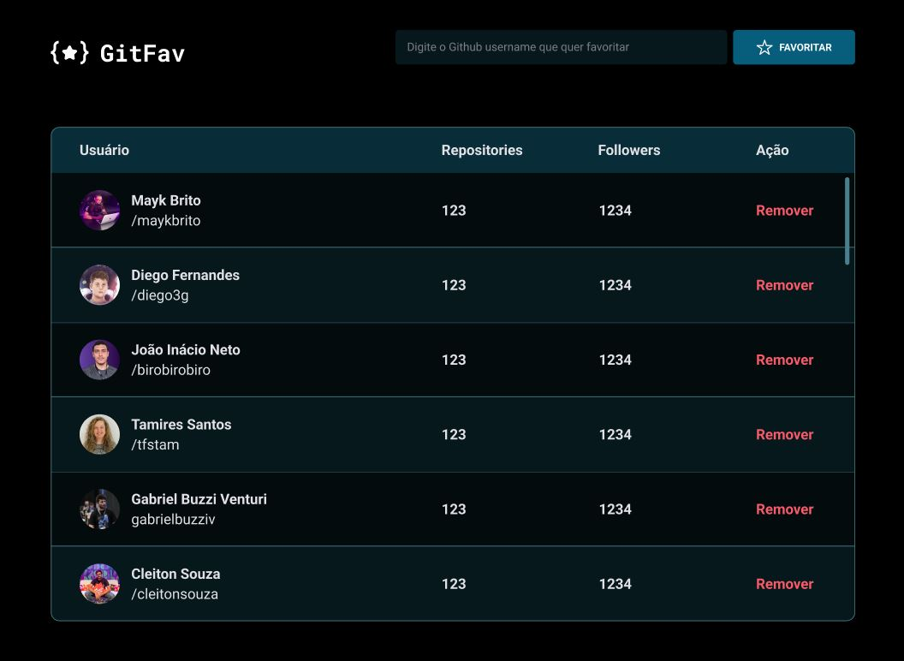
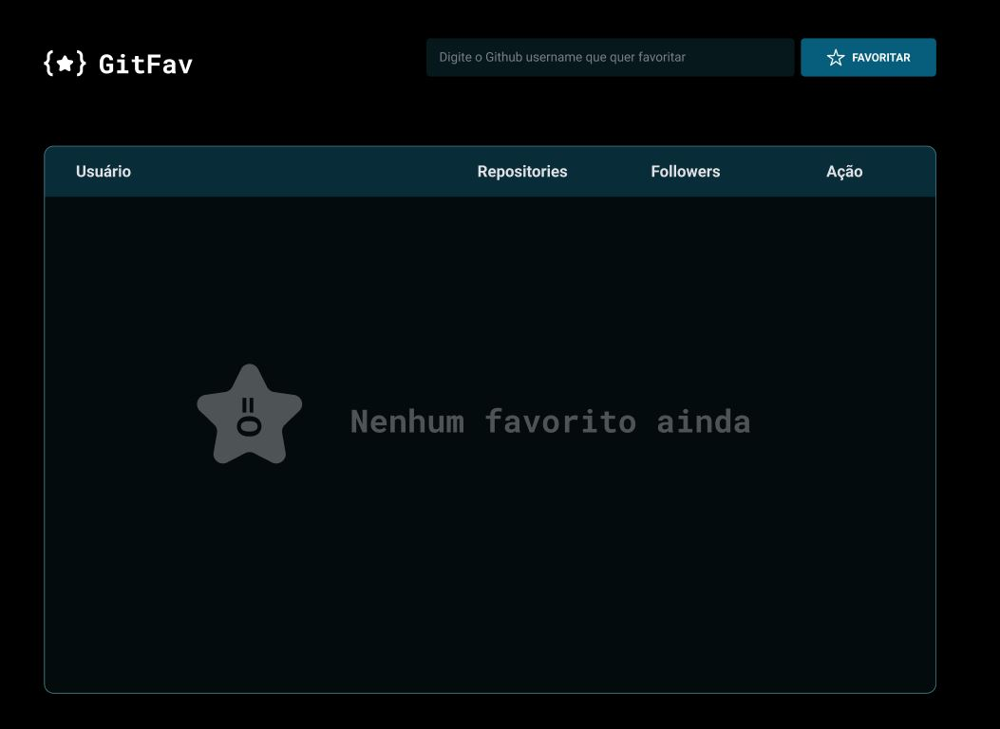

# <h1 align="center"> GitFav </h1>

Aplicação feita com html, css e javascript que consome a API do Github e utiliza o localStorage para armazenar cookie no browser, projeto para desenvolver a lógica, a manipulação da DOM, a utilização de funções callback  

  <a href="#-tecnologias">Tecnologias</a>&nbsp;&nbsp;&nbsp;|&nbsp;&nbsp;&nbsp;
  <a href="#-projeto">Projeto</a>&nbsp;&nbsp;&nbsp;|&nbsp;&nbsp;&nbsp;
  <a href="#-layout">Layout</a>&nbsp;&nbsp;&nbsp;|&nbsp;&nbsp;&nbsp;
  <a href="#memo-licença">Licença</a>

<!-- Licença MIT -->

 

<!-- Imagens do projeto -->

 Imagem salvo os Githubs favoritos

  

 Imagem sem nenhum Github adicionado ao favoritos

  

## 🚀 Tecnologias

Esse projeto foi desenvolvido com as seguintes tecnologias:

- HTML e CSS
- JavaScript
- API Github
- Git e Github
- LocalStorage
- Figma
- Responsivo

## 💻 Projeto

É uma aplicação web onde modelamos o layout com html e css e as funcionalidades em Javascript. A aplicação consome a API do Github e utiliza o localStorage para armazenar cookie no browser, com isso conseguimos pesquisar os githubs que gostamos e adicionamos em uma lista como favoritos. O desafio foi ótimo para praticar a manipulação da DOM com js, para estilização com html e css.

- https://jairtorezone.github.io/gitfav-api/

## 🔖 Layout

Você pode visualizar o layout do projeto através [DESSE LINK](<https://www.figma.com/file/jAClLTJBRf8jAifOkoV0RB/%5BDesafios-Explorer%5D-GitFav-(Copy)-(Copy)?node-id=0%3A1&mode=dev>). É necessário ter conta no [Figma](https://figma.com) para acessá-lo.

## :memo: Licença

Esse projeto está sob a licença MIT.

---

Feito com ♥ by [Jair Torezone](https://www.linkedin.com/in/jair-torezone/) :wave:
